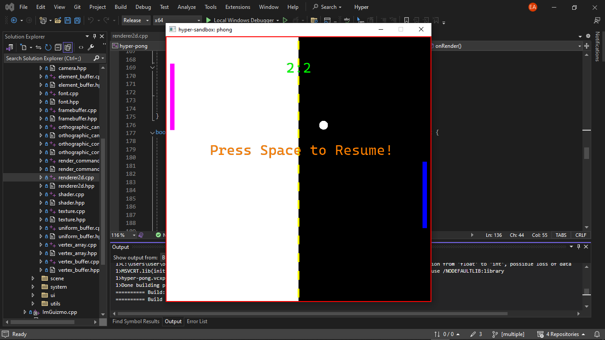

# 🔗 Hyper 🚂

> Bear with me...

Hyper is a 2D game engine developed as a hobby project, aimed at providing a ~~flexible~~ and efficient platform for creating 2D games.

## Key Features

> Note: some of these features are currently not available.

- **Hyper's Rendering**: Hyper's rendering system supports rendering quads, circles, lines, sprites and more, allowing developers to create ~~visually stunning~~ 2D games.

- **Entity-Component System**

- **Physics Simulation**

- **Cross Platform Support**

  - Hyper is currently built on Windows. Targeting other platforms shouldn't be a bottleneck (the only currently platform-specific thing is the logger). most of the APIs Hyper uses are platform-independent.. **so targeting Linux and MacOS wouldn't be a problem.. presumably**.

- **2D Lighting**: I'm heavy on this one. Hyper will support 2D lighting...

- **Scripting**: Hyper will **support scripting via Lua** (the best easy-to-integrate scripting language out there!)

- **An Editor where the magic happens**

> Note: my strikethroughs are just sarcastic expressions of the idea that meaning conveys (e.g. ~~flexible~~, meaning it wasn't during development). When used on nouns, (e.g. ~~3D mesh~~) it could mean not yet supported.

An example of what I built using Hyper during development

> When this snapshot was taken, hyper capabilities weren't there yet... (couldn't render texts and sprites etc.)

> Hyper-pong 🌚 source code can be found here: https://github.com/positron-dev/hyper-pong, in the sandbox project.

